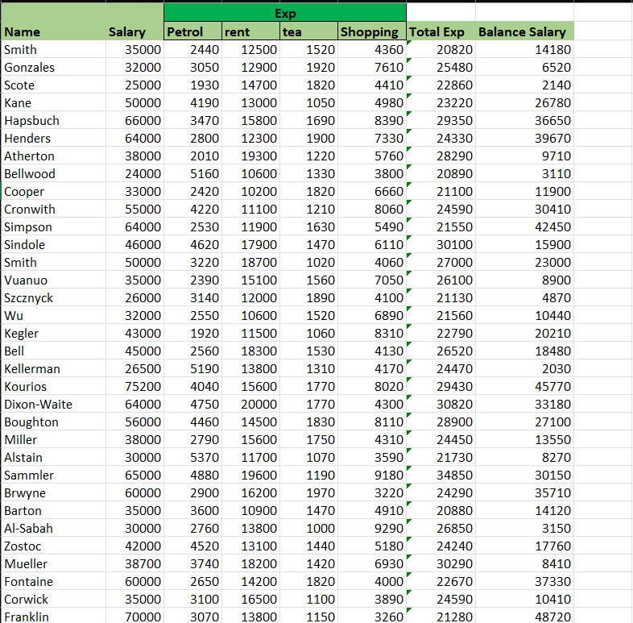

# Excel Basic Calculation Project

## Overview
This project demonstrates basic Excel calculations, spreadsheet operations, and formula usage for data analysis and reporting tasks.

## Skills Used
- Microsoft Excel
- Basic Formulas
- Spreadsheet Formatting
- Data Handling
- Calculations

## Features
- Arithmetic calculations
- Formula implementation
- Organized spreadsheet structure
- Beginner-friendly Excel operations

## Tools Used
- Microsoft Excel

## Project Files
- Excel Basic Calculation.xlsx

## Learning Outcome
This project helped improve practical Excel skills used in data analysis and reporting roles.

## Project Preview

